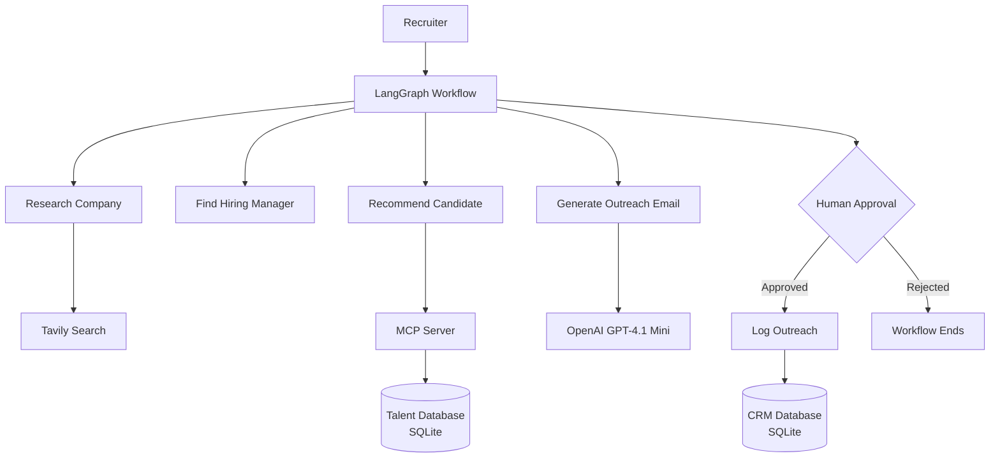
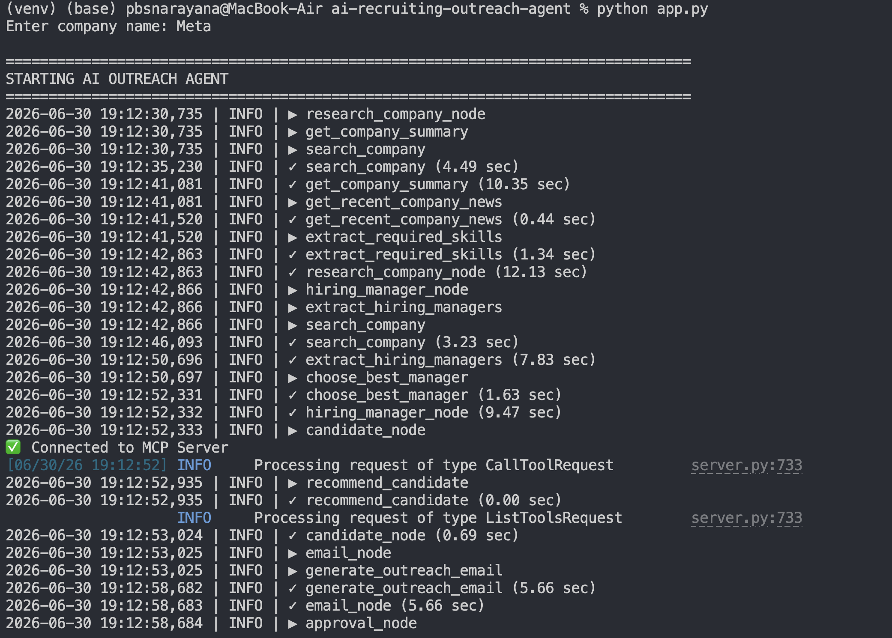
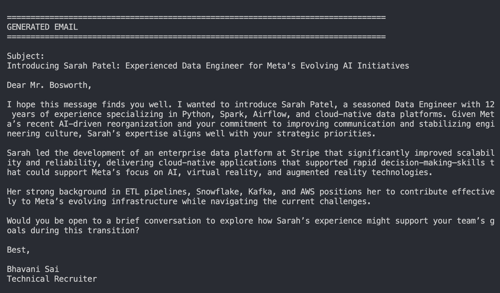
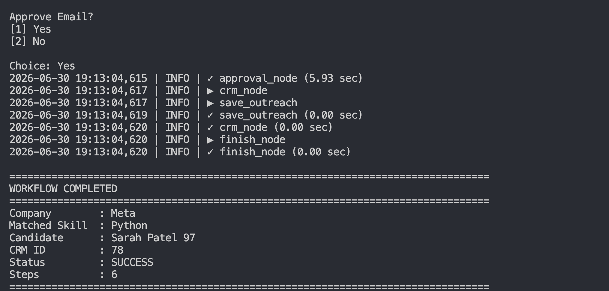

# AI Recruiting Outreach Agent

An AI-powered recruiting workflow for staffing and recruitment agencies. Given a target company, the agent researches the company, identifies the appropriate hiring manager, recommends the best-matching candidate from an internal talent database through a Model Context Protocol (MCP) server, generates a personalized outreach email, requests recruiter approval, and logs approved outreach to a CRM.

**Built with:** LangGraph • OpenAI • Model Context Protocol (MCP) • Tavily Search • SQLite • Docker

---

## Architecture



---

## Demo

### Agent Execution

The agent researches the target company, identifies the hiring manager, retrieves the best-matching candidate through the MCP server, and generates a personalized outreach email.



---

### Generated Outreach Email

A personalized outreach email is created using company research, the selected hiring manager, and the recommended candidate's experience.



---

### Human Approval & Workflow Completion

Before outreach is recorded in the CRM, the recruiter reviews and approves the generated email. The workflow then records the interaction and displays the final execution summary.



---

## Design Decisions

- **LangGraph** orchestrates the recruiting workflow as an explicit state machine, making each stage deterministic and easy to extend.
- **Model Context Protocol (MCP)** exposes the talent database as an external tool, separating the agent from the underlying data source.
- **Human-in-the-Loop (HITL)** ensures recruiter approval before CRM logging, preventing autonomous business actions.
- **Modular Tooling** keeps research, hiring manager discovery, candidate recommendation, email generation, and CRM logging independent and maintainable.
- **Evaluation Pipeline** measures generated email quality separately from execution using an LLM-as-a-Judge.

---

## Tech Stack

| Category | Technology |
|-----------|------------|
| Language | Python 3.11 |
| Agent Framework | LangGraph |
| LLM | OpenAI GPT-4.1 Mini |
| Search | Tavily Search |
| Tool Integration | Model Context Protocol (MCP) |
| Database | SQLite |
| Containerization | Docker |

---

## Project Structure

```text
.
├── data/
├── images/
├── logs/
├── src/
│   ├── database/
│   ├── evaluation/
│   ├── graph/
│   ├── logging/
│   ├── mcp/
│   ├── tools/
│   └── utils/
├── app.py
├── Dockerfile
├── docker-compose.yml
├── pyproject.toml
└── README.md
```

---

## Getting Started

### Clone the repository

```bash
git clone https://github.com/<your-username>/ai-recruiting-outreach-agent.git
cd ai-recruiting-outreach-agent
```

### Create a virtual environment

```bash
python -m venv venv
```

### Activate the environment

**macOS / Linux**

```bash
source venv/bin/activate
```

**Windows**

```bash
venv\Scripts\activate
```

### Install dependencies

```bash
pip install .
```

### Configure environment variables

Create a `.env` file.

```text
OPENAI_API_KEY=your_openai_api_key
TAVILY_API_KEY=your_tavily_api_key
```

### Run the application

```bash
python app.py
```

---

## Running with Docker

Build and start the application.

```bash
docker compose up
```

---

## Evaluation

The project includes a **20-case evaluation pipeline** that measures the quality of generated outreach emails using an LLM-as-a-Judge.

Run the evaluation:

```bash
python -m src.evaluation.run_eval
```

Each generated email is scored across the following dimensions:

- Relevance
- Personalization
- Professional Tone
- Factual Grounding
- Overall Quality

Evaluation results are saved to:

```text
src/evaluation/evaluation_results.json
```

---

## Future Improvements

- Integrate Apollo.io for live hiring contact discovery
- Send approved outreach using the Gmail API
- Replace the SQLite CRM with Salesforce or HubSpot
- Add LangSmith or OpenTelemetry tracing
- Compare multiple LLMs for quality, latency, and cost
- Extend the workflow into a multi-agent recruiting system

---

## License

This project is licensed under the MIT License.